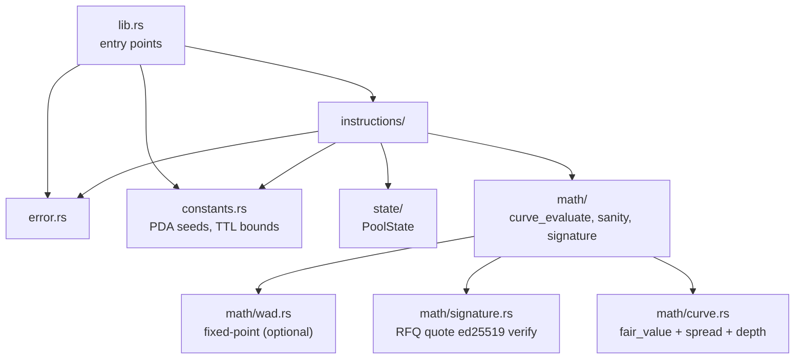

# Architecture

> System components, data flow, account model, PDA design, module
> dependencies. Updated as the program evolves.

**Related docs:** [../CLAUDE.md](../CLAUDE.md) · [SPECIFICATION.md](SPECIFICATION.md) · [OPERATIONS.md](OPERATIONS.md)

---

## 1. System overview

The project is split into two halves:

- **On-chain** — Anchor-based settlement program. Curve evaluation, RFQ signature verification, freshness check, token settlement.
- **Off-chain** — Price engine, oracle worker, RFQ webhook, inventory manager (full detail in [OPERATIONS.md](OPERATIONS.md)).

Design keyword: a **single-MM hybrid** where RFQ is the baseline and the oracle
only intervenes via the PropAMM curve during windows when it is fresh (i.e.
starting the instant a large move is detected). Detailed principles in
[../CLAUDE.md](../CLAUDE.md) "Core design principles".

---

## 2. Components

```
┌─────────────────────────────────────────────────────────────┐
│                    OFF-CHAIN INFRASTRUCTURE                  │
│                                                              │
│  ┌──────────────┐    ┌──────────────────┐    ┌────────────┐  │
│  │ NBBO Feed    │───→│ Price Engine     │───→│ Oracle     │  │
│  │ (Polygon.io) │    │ - Fair value     │    │ Worker     │  │
│  │              │    │ - Spread/skew    │    │ (Mode A/B) │  │
│  │ Pyth/Raydium │───→│ - Mode controller│    └─────┬──────┘  │
│  └──────────────┘    │ - Trigger eval   │          │         │
│                      └────────┬─────────┘          │         │
│                               │                    │         │
│                               ▼                    │         │
│                      ┌──────────────────┐          │         │
│                      │ RFQ Webhook      │          │         │
│                      │ (always on)      │          │         │
│                      └────────┬─────────┘          │         │
│                               │                    │         │
│                      ┌────────▼─────────┐          │         │
│                      │ Inventory Mgr    │          │         │
│                      │ (Backed mint/    │          │         │
│                      │  redeem)         │          │         │
│                      └──────────────────┘          │         │
└──────────────────────────────┼─────────────────────┼─────────┘
                               │ signed quote        │ oracle push
                               │                     │
┌──────────────────────────────┼─────────────────────┼─────────┐
│                              │  ON-CHAIN           │         │
│                              ▼                     ▼         │
│                  ┌──────────────────────────────────┐        │
│                  │   SETTLEMENT PROGRAM (Solana)    │        │
│                  │                                  │        │
│                  │   - Curve state (params + reserves)│      │
│                  │   - TTL freshness check          │       │
│                  │   - Signature verification       │       │
│                  │   - Mode-aware settlement        │       │
│                  └──────────────────────────────────┘        │
│                              ▲                               │
│                              │ swap tx (+ optional quote)    │
└──────────────────────────────┼───────────────────────────────┘
                               │
                       ┌───────┴────────┐
                       │  User Client   │
                       │  (via Jupiter) │
                       └────────────────┘
```

### 2.1 Component-role summary

| Component           | Where      | Role                                                                                |
|---|---|---|
| NBBO Feed           | off-chain  | Collects prices from Polygon.io, Pyth, Raydium, ...                                  |
| Price Engine        | off-chain  | Composes fair value, computes spread / skew, decides the mode                       |
| Oracle Worker       | off-chain  | Pushes `update_oracle` transactions (active only in Mode A/B)                       |
| RFQ Webhook         | off-chain  | Returns JupiterZ-spec quotes; runs in every mode                                    |
| Inventory Mgr       | off-chain  | Watches reserves and triggers Backed mint/redeem                                    |
| Settlement Program  | on-chain   | Curve evaluation, signature verification, freshness check, token settlement         |
| User Client         | off-chain  | Submits the swap transaction (usually via the Jupiter router)                       |

---

## 3. Data flow

### 3.1 Curve-fresh path (most common in Mode A/B)

```
User → Jupiter route → swap tx (no signed quote, or quote ignored)
     → Settlement program
     → freshness check: curve_age <= TTL → fresh
     → curve_evaluate(reserves, fair_value, spread, depth)
     → token settlement + reserves update
```

### 3.2 Curve-stale path (Mode C, or when Mode A/B push is delayed)

```
User → Jupiter route → RFQ webhook call
     → off-chain price engine issues a signed quote
     → swap tx (with signed quote attached)
     → Settlement program
     → freshness check: curve_age > TTL → stale
     → verify_signature + expiry/user/direction checks
     → sanity bound check (deviation from curve fair_value)
     → settle at the quote price + reserves update
```

### 3.3 Oracle-push path (background in Mode A/B)

```
Price engine → detects movement (Mode A: every 100–200ms, Mode B: when thresholds exceeded)
            → Oracle worker
            → update_oracle tx (nonce++, fair_value, spread, depth, ttl)
            → Settlement program updates PoolState
            → reserves are untouched
```

### 3.4 Cancel-priority path (the core value of Mode A)

```
A large NBBO move occurs
   → Price engine immediately issues an oracle-update tx (with a Jito tip-per-CU)
   → Settlement program lands the update first within the same slot/block
   → Any stale-quote sniper swap tx that arrives next is priced against the new fair_value
```

---

## 4. Account Model

### 4.1 Diagram

```mermaid
graph TD
    M["MM Authority<br/>(oracle worker key + admin key)"]
    M --> P["PoolState<br/>PDA: ['pool', base_mint, quote_mint]<br/>params + freshness + permissions"]
    P --> BV["Base Vault<br/>PDA: ['vault', pool, base_mint]<br/>SPL TokenAccount owned by pool"]
    P --> QV["Quote Vault<br/>PDA: ['vault', pool, quote_mint]<br/>SPL TokenAccount owned by pool"]
    U["User (Signer)"]
    U -->|execute_swap (curve path)| P
    U -->|execute_swap (RFQ path)| QNM["QuoteNonceMarker<br/>PDA: ['quote_used', pool, nonce]<br/>one-shot replay marker"]
    QNM -.->|init enforced| P
    U --> UB["User Base ATA"]
    U --> UQ["User Quote ATA"]
    M -->|update_oracle| P
    M -->|set_paused / rotate_oracle_signer| P
    K["Keeper / Anyone"]
    K -->|close_expired_nonce<br/>(after expiry+buffer elapses)| QNM
```

### 4.2 Per-account responsibilities

- **PoolState**: pricing parameters (`fair_value`, `spread_bps`, `depth_curve_params`, `inventory_skew_params`), freshness (`last_oracle_update_slot`, `oracle_nonce`, `current_mode_ttl`), authority (`admin`, `authorized_oracle_signer`), and the kill switch (`paused`). **No `reserves_*` field** — we always read `vault.amount` directly.
- **Base Vault / Quote Vault**: actual token balances + real-time inventory single source of truth. PoolState acts as the PDA signer when transferring from a vault to the user.
- **QuoteNonceMarker**: blocks SignedQuote replay. `init` is enforced in the RFQ path. Reclaimable via `close_expired_nonce` (acts as a sliding bitmap).
- **User ATAs**: ordinary SPL Associated Token Accounts.

> Full field definitions in [SPECIFICATION.md §2 (State)](SPECIFICATION.md#2-state).

---

## 5. PDA seed design

| PDA                  | Seeds                                          | Stored bump                          | Purpose                                                                  |
|---|---|---|---|
| `pool_state`         | `[b"pool", base_mint, quote_mint]`             | Yes (PoolState.bump)                 | Unique pool state per (base, quote) pair                                 |
| `base_vault`         | `[b"vault", pool_state, base_mint]`            | Yes (PoolState.base_vault_bump)      | Pool's base-token vault                                                  |
| `quote_vault`        | `[b"vault", pool_state, quote_mint]`           | Yes (PoolState.quote_vault_bump)     | Pool's quote-token vault                                                 |
| `quote_nonce_marker` | `[b"quote_used", pool_state, nonce_le_bytes]`  | Yes (QuoteNonceMarker.bump)          | Blocks RFQ quote replay (one-shot)                                       |

**Invariants:**
- The (base_mint, quote_mint) pair must be sorted lexicographically (`base_mint < quote_mint`) → prevents duplicate pools.
- All bumps are stored (saves CPI signer-seed reconstruction cost).
- `authorized_oracle_signer` is a PoolState field (not a PDA — just a Pubkey); rotatable via `rotate_oracle_signer`.
- `quote_nonce_marker` is `init`'d only on the RFQ path. The curve path never touches it — RFQ-only PDA.

---

## 6. Module dependencies



### 6.1 Directory mapping

```
programs/protocol/src/
├── lib.rs                       # 8 instruction entry points
├── constants.rs                 # PDA seeds, MAX_TTL_SLOTS, MAX_SPREAD_BPS, SAFETY_BUFFER_SLOTS, PRICE_SCALE
├── error.rs                     # Error codes (kept in sync with SPECIFICATION.md §4)
├── events.rs                    # 8 events (SPECIFICATION.md §3.9)
├── instructions/
│   ├── mod.rs
│   ├── init_pool.rs
│   ├── update_oracle.rs
│   ├── execute_swap.rs
│   ├── set_paused.rs
│   ├── rotate_oracle_signer.rs
│   ├── rotate_admin.rs
│   ├── admin_withdraw_inventory.rs
│   └── close_expired_nonce.rs
├── state/
│   ├── mod.rs
│   ├── pool.rs                  # PoolState struct (no reserves_*)
│   └── quote_nonce_marker.rs    # QuoteNonceMarker struct
└── math/
    ├── mod.rs
    ├── curve.rs                 # Linear-bps quote curve (fair_value + spread + depth + skew)
    ├── signature.rs             # SignedQuote ed25519 verify
    └── wad.rs                   # (currently unused; reserved for future dynamic-spread work)
```

> Same module layout as the CLAUDE.md boilerplate. WAD is not part of the
> primary v0 math model (prices are integer prices + bps spread composition),
> but is kept for future rate-based extensions.

---

## 7. Security considerations

### 7.1 Core invariants

- **`update_oracle` never touches a vault** — it only updates pricing parameters (`fair_value`, `spread_bps`, depth, skew, nonce, TTL). Token movement happens only in `execute_swap` ([SPECIFICATION.md §3.2](SPECIFICATION.md#32-update_oracle)).
- `execution_price` is evaluated against `vault.amount` *at execution time* → consistent even with in-slot multi-trades (Solana refreshes account state between instructions automatically).
- The oracle nonce is monotonic → blocks `update_oracle` replay.
- Quote nonces are one-shot (PDA init enforced) → blocks RFQ quote replay.
- TTL=0 always means stale → Mode C forces the RFQ path.
- Only `authorized_oracle_signer` can call `update_oracle`.

### 7.2 Risks specific to the hybrid design + mitigations

- **Two-source race**: **Curve wins** (when curve is fresh, quote is ignored). Preserves the PropAMM-primary principle + composability.
- **Stale/fresh boundary attacks**: mitigated by conservative TTLs (A=1, B=3) + cancel priority (Jito tip-per-CU).
- **Quote replay**: `QuoteNonceMarker` PDA `init` is enforced + `close_expired_nonce` provides a sliding bitmap.
- **Oracle nonce replay**: enforced by monotonic `PoolState.oracle_nonce`.
- **Large quote/fair_value gap**: no sanity-bound guard. Reason: the oracle updates only on large moves, so a wide gap can be a legitimate signal. We defend against actual exploits via cancel priority.
- **Oracle worker key exposure**: rotate instantly via the `rotate_oracle_signer` admin instruction.

### 7.3 Standard Solana risks

- Signer verification (Anchor `#[account(signer)]`)
- PDA seed/bump verification (Anchor `#[account(seeds=..., bump=...)]`)
- Token-program ownership verification
- Checked arithmetic (CLAUDE.md rule)
- Do NOT use `init_if_needed` — pools are initialized explicitly by the admin via `init_pool`.

> Adversarial-bot model and new-attack-vector hypotheses live in
> [OPERATIONS.md §11 (Research methodology)](OPERATIONS.md#11-research-methodology).

---

## 8. Compute-unit budget

| Instruction                       | First estimate | Notes                                                            |
|---|---|---|
| `init_pool`                       | 30–35k CU      | One-shot (includes ~2k for event emit)                           |
| `update_oracle`                   | 2–6k CU        | HumidiFi reference ~143 CU. 5 PoolState fields + nonce + event   |
| `execute_swap` (curve fresh)      | 32–55k CU      | Linear-bps curve evaluate + token transfer + event               |
| `execute_swap` (RFQ fallback) | 42–85k CU | ed25519 verify + QuoteNonceMarker init + event |
| `set_paused`                      | 5–7k CU        | Flag toggle + event                                              |
| `rotate_oracle_signer`            | 5–7k CU        | Single-Pubkey update + event                                     |
| `rotate_admin`                    | 5–7k CU        | Single-Pubkey update + event                                     |
| `admin_withdraw_inventory` | 15–28k CU | vault → admin ATA transfer + event |
| `close_expired_nonce` | 5–12k CU | account close + event |

> Each event-emit adds ~1–3k CU per instruction. Every instruction emits an
> event ([SPECIFICATION.md §3.9](SPECIFICATION.md#39-events)).

Everything runs under the default 200k CU budget. Measurements live in the
`consumed` lines of `.anchor/program-logs/*.log`.

---

## 9. Cross-program Invocation (CPI)

- Token transfer (SPL Token program) — vault → user, user → vault
- Ed25519 signature verification — call Solana's native ed25519 program (or syscall — under review).
- External oracle-program calls are out of v1 scope (Pyth/Switchboard are consumed off-chain by the price engine).

---

## 10. Out of v1 scope

- Multi-MM (v3 consideration)
- Per-pair fee-tier negotiation system
- Automated issuer-fee settlement (v1 is off-chain manual settlement)
- Native prediction markets / perps
- Token-2022 extensions (v2 consideration)

---

## 11. Comparative positioning

Where this project sits relative to existing systems:

| System                | Primary path     | Fallback             | Inventory                                  | Mode switching | RWA applicability    |
|---|---|---|---|---|---|
| Drift v2 JIT          | Auction (RFQ-like)| vAMM                 | Multi LP                                   | None           | Perps                |
| UniswapX              | Signed intent    | V3 pool guard        | Passive LP                                 | None           | None                 |
| Pyth Express Relay    | RFQ              | Pyth anchor          | MM                                         | None           | Possible             |
| Hashflow              | RFQ              | None                 | MM                                         | None           | None                 |
| HumidiFi (core)       | PropAMM          | None (reject)        | MM capital                                 | None           | None                 |
| HumidiFi Aquarium     | PropAMM          | None                 | Issuer deposit                             | None           | None                 |
| Byreal (Bybit)        | RFQ              | CLMM (passive)       | LP                                         | None           | xStocks              |
| **This project**      | **RFQ baseline** | **PropAMM curve (TTL-based)** | **External inventory (PoC), issuer deposit (production)** | **Automatic (A/B/C)** | **Target** |

**Direct competitors:**
- **HumidiFi Aquarium** — same business model (issuer-deposit MMaaS) but always-on shared oracle. Explicitly rejects RFQ (hurts composability). This project resolves that via the hybrid. Aquarium weakness: no story for market-closed windows → poor RWA fit.
- **Byreal (Bybit)** — direct competitor on xStocks. Architecture is RFQ + CLMM passive pool. Bybit's capital and user base are the threat. Our edge: more refined hybrid + single-MM efficiency.

**Decisive differentiators:**
1. **Inverted direction** — RFQ baseline + PropAMM intervention (every other system is RFQ-primary + AMM guard).
2. **MM toggles its own oracle by cost-benefit** — automatic Mode A/B/C switching.
3. **NBBO + Raydium 2-source synthesis** — handles the dual-price problem for tokenized assets.
4. **Explicit handling for market-closed / low-vol windows** — RFQ fallback makes 24/7 possible.
5. **Cancel priority + composability simultaneously** — existing systems trade one off.

---

## 12. Non-technical risks

### 12.1 Tech dependencies
- NBBO feed outage → need a fallback policy (Pyth + Raydium)
- Solana network congestion → can neutralize cancel priority
- Backed redemption delay → inventory imbalance

### 12.2 Market
- Stagnating xStocks volume growth
- HumidiFi expanding into RWAs (Aquarium → RWA extension)
- Bybit Byreal acquiring users quickly
- Backed launching its own venue

### 12.3 Regulatory
- Tokenized equities restricted to non-US users
- Open question whether Korea / Asia users are eligible
- Legality of redistributing NBBO data ([TODO.md §1](../TODO.md))

### 12.4 Operational
- Staffing for Mode-A-window monitoring
- Replenishing capital after inventory loss
- User losses from quote staleness → reputation
- Oracle worker key exposure → recoverable via `rotate_oracle_signer`
